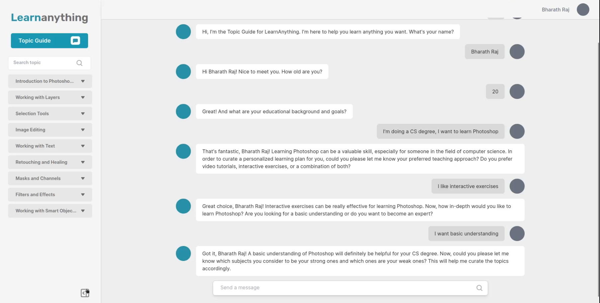

# Learnanything 

WIP Prototype Screenshot:

Instructions for running the demo:
* `git clone https://github.com/bharathraj-v/learn-anything`
* `cd learn-anything`
* `cd frontend`
* `npm install`
* `npm run dev`
* in another terminal tab, cd to learn-anything/backend/
* `pip install -r requirements.txt`
* `python manage.py runserver`
* Enter your OpenAI API key in the onboarding page
* Try out the topic guide that curates topics for you!
